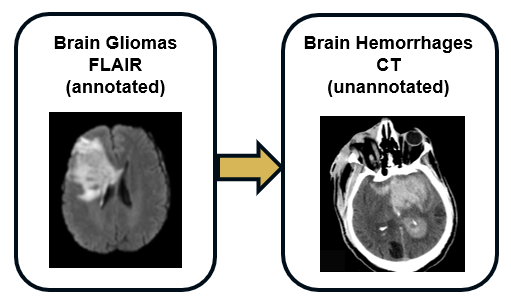

# Cross-Modality segmentation : M-GenSeg 2D


## Initialization

Clone repo "git clone https://github.com/MaloADBA/MGenSeg_2D.git"

Run "pip install -r requirements.txt" to install dependencies. 

Run "git submodule init" to initialize submodules.

Run "git submodule update" to download submodules.

## This repo handles several domain adaptation and baseline models for cross-modality segmentation :

'M-GenSeg'

'AccSegNet' (https://link.springer.com/chapter/10.1007/978-3-030-87193-2_5)

'AttENT' (https://ieeexplore.ieee.org/document/9669620)

'UAGAN' (https://arxiv.org/abs/1907.03548) --> For comparison with a fully supervised model

'Supervised TransUnet' (https://arxiv.org/abs/2102.04306) --> For comparison with a fully supervised model

## Task : domain adaptation for tumor segmentation with BRATS

We build an unsupervised domain adaptation task with BraTS where each MR contrast (T1,T1ce,FLAIR,T2) is considered as a distinct modality. The models provided aim at reaching good segmentation performances on an unlabeled target modality dataset by leveraging annotated source images of an other modality.

We use the 2020 version of the BRATS data from https://www.med.upenn.edu/cbica/brats2020/data.html. Once downloaded to `<download_dir>`, this data can be prepared for domain adaptation tasks using a provided script, as follows:

```
python scripts/data_preparation/Prepare_multimodal_brats_2D.py --data_dir "<download_dir>" --save_to "/path/data.h5" --min_tumor_fraction 0.01 --min_brain_fraction 0.25 --no_crop --skip_bias_correction

```
Data preparation creates a new dataset based on BRATS that contains 2D hemispheres, split into sick and healthy subsets for each possible contrast (T1, T1ce, FLAIR, T2).

### Launching experiments

Run "source register submodules.sh"

#### Launching training for MGenSeg

In this example, we used the MGenSeg variant with attention gates as skip-connections :
`model/configs/mbrats/bds3_106_sc_residual_attention_ulti_nmsc_dif.py`

In our configurations, the decoders are mostly shared for the segmentation path. When run in `mode=0` (passed in `forward` call; default), the decoder outputs an image, with `tanh` normalization at the output; when run in `mode=1`, it outputs a segmentation mask, with `sigmoid` normalization at the output. Modes 0 and 1 differ in three ways:
1. The final norm/nonlinearity/convolution block is unique for each mode.
2. The final nonlinearity is `tanh` in mode 0 and `sigmoid` in mode 1.
3. Every block in the decoder is normalized with its own set of normalization parameters.

An example of an experiment launched with this config is:
```
python3 mbrats_segmentation_ulti_nmsc_dif.py --data /path/Data/mbrats/ --path /log_and_save_model_to/ --model_from model/configs/mbrats/bds3_106_sc_residual_attention_ulti_nmsc_dif.py --model_kwargs '{"lambda_enforce_sum": 1, "lambda_disc": 6, "lambda_seg": 20, "lambda_x_id": 20, "lambda_z_id": 2, "lambda_mod_disc": 3, "lambda_mod_cyc": 20, "lambda_mod_x_id": 0, "lambda_mod_z_id": 0}' --weight_decay 0.0001 --source_modality 't1' --target_modality 't2' --labeled_fraction_source 1 --labeled_fraction_target 0  --batch_size_train 15 --batch_size_valid 15 --epochs 250 --opt_kwargs '{"betas": [0.5, 0.999], "lr": 0.0001}' --optimizer amsgrad --augment_data --nb_proc_workers 2 --n_vis 4 --init_seed 1234 --data_seed 0 
```

Optimizer arguments are passed as a JSON string through the `--opt_kwargs` argument.

Loss hyperparameters can be changed in the `--model_kwargs` argument.

Pick source and target contrasts (t1, t1ce, flair or t2) with `--source_modality` and `--target_modality` arguments.

Select the % of annotated data that is fed to the network with `--labeled_fraction_source` and `--labeled_fraction_target` arguments.

As the workflow is symmetrical with regard to source and target modalities, using the following parameters is equivalent to the one mentionned above :

```
python3 mbrats_segmentation_ulti_nmsc_dif.py --data /path/Data/mbrats/ --path /log_and_save_model_to/ --model_from model/configs/mbrats/bds3_106_sc_residual_attention_ulti_nmsc_dif.py --model_kwargs '{"lambda_enforce_sum": 1, "lambda_disc": 6, "lambda_seg": 20, "lambda_x_id": 20, "lambda_z_id": 2, "lambda_mod_disc": 3, "lambda_mod_cyc": 20, "lambda_mod_x_id": 0, "lambda_mod_z_id": 0}' --weight_decay 0.0001 --source_modality 't2' --target_modality 't1' --labeled_fraction_source 0 --labeled_fraction_target 1  --batch_size_train 15 --batch_size_valid 15 --epochs 250 --opt_kwargs '{"betas": [0.5, 0.999], "lr": 0.0001}' --optimizer amsgrad --augment_data --nb_proc_workers 2 --n_vis 4 --init_seed 1234 --data_seed 0 
```

Note that we do not handle training on multiple GPUs.

#### Pretrained models

We make available 4 pretrained models, respectively corresponding to T1ce --> FLAIR, FLAIR --> T2, T2 --> T1, T1 --> T1ce domain adaptations where 100% of source data is annotated and 0% of target data is annotated.

They are available here : (link will be made available after rebuttal as the drive is linked to a none anonymous google account) 
To load the models, use the following code :
```
from utils.experiment import experiment
from mbrats_segmentation_ulti_nmsc_dif import get_parser as get_model_parser
def load_model(experiment_path): 
    # Load args.
    print("Loading experiment arguments.")
    args_path = os.path.join(experiment_path, 'args.txt')
    model_parser = get_model_parser()
    with open(args_path, 'r') as f:
        saved_args = f.read().split('\n')[1:]
        saved_args[saved_args.index('--path')+1] = experiment_path
        model_args = model_parser.parse_args(args=saved_args)
    experiment_state = experiment(model_args)
    model = experiment_state.model['G']
    return model
```

#### Launching training for Baselines

Same can be done for AccSegNet :
```
python3 mbrats_accsegnet.py --data /path/Data/mbrats/ --path /log_and_save_model_to/accsegnet/ --model_from "model/configs/mbrats/accsegnet.py" --model_kwargs '{"lambda_disc": 1, "lambda_seg": 1, "lambda_anatomy": 1, "lambda_contraste": 2, "lambda_id": 1}' --weight_decay 0.0001 --source_modality 't2' --target_modality 't1' --labeled_fraction_source 1 --labeled_fraction_target 0 --batch_size_train 10 --batch_size_valid 10 --epochs 300 --opt_kwargs '{"betas": [0.5, 0.999], "lr": 0.0001}' --optimizer amsgrad --augment_data --nb_proc_workers 2 --n_vis 10 --init_seed 1111 --data_seed 0
```

And UAGAN :
```
python3 mbrats_uagan.py --data /path/Data/mbrats/ --path /log_and_save_model_to/uagan/ --model_from "model/configs/mbrats/uagan.py" --model_kwargs '{"lambda_seg": 20, "lambda_id": 1, "lambda_disc": 1, "lambda_class": 10, "lambda_gp": 0}' --source_modality 't1' --target_modality 't2' --weight_decay 0.0001 --batch_size_train 1 --batch_size_valid 1 --epochs 200 --opt_kwargs '{"betas": [0.5, 0.999], "lr": 0.0001}' --optimizer adam --augment_data --nb_proc_workers 2 --n_vis 10 --init_seed 1234 --data_seed 0 
```

And supervised TransUnet (with the `--yield_only_labeled` argument, only labeled data is passed to the model):
```
python3 mbrats_segmentation_transunet.py --data /path/Data/mbrats/ --path /log_and_save_model_to/transunet/ --model_from "model/configs/mbrats/Transunet.py" --weight_decay 0.0001 --batch_size_train 10 --batch_size_valid 10 --epochs 201 --optimizer amsgrad --augment_data --nb_proc_workers 2 --n_vis 8 --init_seed 1234 --data_seed 0 --source_modality 't1' --target_modality 't2' --labeled_fraction_source 1 --labeled_fraction_target 0 --opt_kwargs '{"betas": [0.5, 0.999], "lr": 0.0001}' --yield_only_labeled
```

AttENT is a 2 stages method, so first train modality translation with :
```
python3 mbrats_attnet_trans.py --data /path/Data/mbrats/ --path /log_and_save_model_to/attnet/trans/ --model_from "model/configs/mbrats/attnet_trans.py" --model_kwargs '{"lambda_disc": 1, "lambda_cyc": 4}' --source_modality 't1' --target_modality 'flair' --weight_decay 0.0001 --batch_size_train 10 --batch_size_valid 10 --epochs 100 --opt_kwargs '{"betas": [0.5, 0.999], "lr": 0.0001}' --optimizer amsgrad --augment_data --nb_proc_workers 2 --n_vis 10 --init_seed 1234 --data_seed 0
```

Then run the 'scripts/data_preparation/compute_translation_attnet_mbrats.py' file to generate the synthetic target modality datasets.

Finally run the segmentation part with  : 
```
python3 mbrats_attnet_seg.py --data /path/Data/mbrats/attent/t1_flair.h5'' --path /log_and_save_model_to/attnet/seg/ --model_from "model/configs/mbrats/attnet_seg.py" --model_kwargs '{"lambda_disc_main": 0.001, "lambda_disc_aux": 0.0002, "lambda_seg_main": 1, "lambda_seg_aux": 0.1}' --weight_decay 0.0001 --source_modality 't1' --target_modality 'flair' --labeled_fraction_1 1 --labeled_fraction_2 0 --batch_size_train 25 --batch_size_valid 25 --epochs 200 --opt_kwargs '{"betas": [0.5, 0.999], "lr": 0.0001}' --optimizer adam --augment_data --nb_proc_workers 2 --n_vis 10 --init_seed 1234 --data_seed 0
```


## Task : cross-pathology and cross-modality domain adaptation for intra-cerebaral hemorrhage CT segmentation with FLAIR glioma MRIs from BraTS



We offer a new task where annotated gliomas in FLAIR sequences from the BraTS dataset can be leveraged to segment intra-cerebral hemorrhages on CT scans from the RSNA 2019 Kaggle challenge (https://www.kaggle.com/c/rsna-intracranial-hemorrhage-detection). As these two types of lesions show similar structures and patterns, the cross-pathology and cross-modality segmentation is feasible without any annotation in the CT target modality.

Once the CT data downloaded, the brain extraction can be performed using the CT_BET pretrained U-Net from https://github.com/aqqush/CT_BET. For our study we use only a subset of the RSNA 2019 Kaggle challenge, where CT hemorrhages were segmented by medical experts (note that this segmented data is not publicly available yet, as it may be used in the future for other tasks/publications). These segmentations only serve the purpose of model evaluation and were not used for training. 

After the brain extraction, our repository for CT data has the following structure :

<CT_data_dir>
- Images
    - ID_001
    - ID_002
    - ...
- Brain_masks (Segmented brain from CT_BET)
    - ID_001
    - ID_002
    - ...
- Masks (Brain hemorrhages segmentations)
    - ID_001
    - ID_002
    - ...

The data can then be preprocessed (2D slicing and diseased/healthy hemisphere labeling) to be used by M-GenSeg, using the following command:

```
python scripts/data_preparation/Prepare_ct_trans_2d_ss.py --data_dir "<CT_data_dir>" --save_to "/path/mr_ct_translation_ct_ss.h5"

```

As for source modality, we use the FLAIR sequences from the 2020 BraTS dataset from https://www.med.upenn.edu/cbica/brats2020/data.html. Once downloaded to `<brats_download_dir>`, this data can be prepared for the domain adaptation task (FLAIR extraction, 2D slicing and diseased/healthy hemisphere labeling) using a provided script, as follows:

```
python scripts/data_preparation/Prepare_flair_trans_2d_ss.py --data_dir "<brats_download_dir>" --save_to "/path/mr_ct_translation_flair_ss.h5"

```


### Launching experiments

python3 mr_ct_segmentation_ulti_nmsc_dif.py --data_mr '/home/maloadba/Data/MR_CT/mr_ct_translation_flair_ss.h5' --data_ct '/home/maloadba/Data/MR_CT/mr_ct_translation_ct_ss.h5' --path /scratch/maloadba/experiments/MR_CT/mgenseg/sup/1/ --model_from /home/maloadba/ssl-seg-eugene/model/configs/mr_ct/bds3_mr_ct.py --model_kwargs '{"lambda_enforce_sum": 1, "lambda_disc": 6, "lambda_seg": 20, "lambda_x_id": 20, "lambda_z_id": 2, "lambda_mod_disc": 3, "lambda_mod_cyc": 20, "lambda_mod_x_id": 0, "lambda_mod_z_id": 0}' --weight_decay 0.0001 --labeled_fraction_source 1 --labeled_fraction_target 1  --batch_size_train 10 --batch_size_valid 10 --epochs 250 --opt_kwargs '{"betas": [0.5, 0.999], "lr": 0.0001}' --optimizer amsgrad --augment_data --nb_proc_workers 2 --n_vis 4 --init_seed 1234 --data_seed 0


